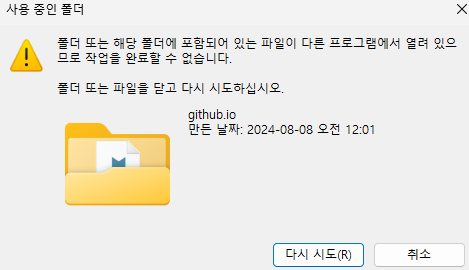
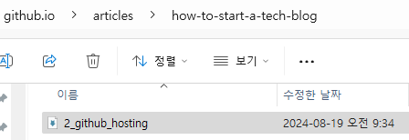

# 2. 기술 블로그를 유저가 볼 수 있게 게시하기

자기소개서를 다듬느라, 기술 블로그 작업에서 1주일 정도 손을 놓았다. 다시 시작할 때다.
Github Pages를 이용하면 블로그를 호스팅할 수 있다는 것은 알고 있다.

읽은 자료 : [[github] 깃허브를 이용한 무료 호스팅](https://velog.io/@sangyoung23/github-%EA%B9%83%ED%97%88%EB%B8%8C%EB%A5%BC-%EC%9D%B4%EC%9A%A9%ED%95%9C-%EB%AC%B4%EB%A3%8C-%ED%98%B8%EC%8A%A4%ED%8C%85) `sanyoung park, 2022.12.14`

##### 1차 시도: Deploy from a branch

1. 새 레포지토리를 만든다.
2. Pages Source 설정을 Deploy from a branch로 잡는다.
3. 몇 분 기다리면, https://hunter-hwang-dev.github.io/blog/ 과 같은 주소가 생성된다.

##### Github Actions?
Pages Source 설정을 Github Actions로 바꿀 수도 있다고 하는데, 어떤 장점이 있는지 찾아보았다.
CI/CD 툴 = 개발 workflow 자동화
- CI = 테스트, 빌드, Dockerizing, 저장소에 전달 - 배포 준비
- CD = 배포(실제 사용자에게 전달)
아직 사용할 단계는 아닌 것 같다.

##### 커스텀 도메인 사용하기?

|도메인|신규 구독|연장|비고|
|--|--|--|--|
|hunter-hwang-dev.github.io|무료|무료|레포지토리 이름 고정|
|hunter-hwang-dev.github.io/blog/|무료|무료||
|hunter-hwang-dev.blog|5,000원/1년|30,000원/1년|hosting.kr 이벤트|

github.io 주소가 예쁘다. 그냥 그대로 사용해도 되겠다. 레포지토리 이름을 수정하기 전, 로컬 raw-blog 폴더명을 `github.io`에서 `raw-blog`로 수정하겠다. 

##### 냅다 로컬 폴더 이름을 바꾸고, 위치를 옮기면 어떻게 되는데?

이런, 우선 VS Code를 잠깐 끄고 폴더명을 변경하고 오겠다.

```
hunter-hwang-dev (변경 전)
├── github.io (raw)
└── blog (hosting)
``` 

``` 
hunter-hwang-dev (변경 후)
└── tech-blog-total
    ├── raw
    └── hosting
``` 

이러고 VS Code를 다시 실행하니, 2_github_hosting.md 가 보여 바로 수정했다. 하지만 이는 원래 위치였던, `github.io/articles/how-to-start-a-tech-blog`에 임시 저장 파일이 달랑 한 개 생성된 상황.



날려버리고 수정된 위치로 가서, 저장 후 commit & push를 날려보았다.


`작성일: 2024-08-19` | `최종 수정일: 2024-08-19`